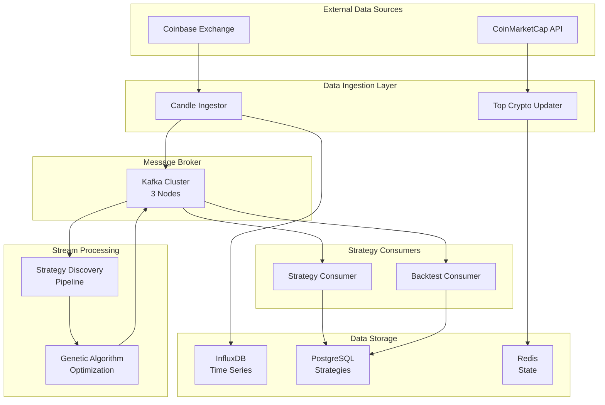

<p align="center">
  
</p>

<p align="center">
  <strong>An open-source algorithmic trading platform powered by genetic algorithms and real-time stream processing</strong>
</p>

<p align="center">
  <a href="#features">Features</a> •
  <a href="#architecture">Architecture</a> •
  <a href="#getting-started">Getting Started</a> •
  <a href="#documentation">Documentation</a> •
  <a href="#contributing">Contributing</a>
</p>

<p align="center">
  
  
  
  
</p>

---

## Overview

TradeStream is a production-grade algorithmic trading platform that discovers, optimizes, and executes trading strategies using genetic algorithms and real-time stream processing. The platform continuously analyzes market data across cryptocurrency markets to identify profitable trading opportunities.

**For current project status and development progress, see [GitHub Issues](../../issues).**

### Key Capabilities

| Capability | Description |
|------------|-------------|
| **Strategy Discovery** | Genetic algorithm optimization discovers optimal trading strategies from 60+ technical indicators |
| **Real-Time Processing** | Apache Beam on Flink processes market data and strategy signals with sub-second latency |
| **Production Scale** | 40M+ strategy discoveries, 1000+ candles/minute ingestion, 240+ days continuous operation |
| **Cloud Native** | Kubernetes-native architecture with Helm charts for reproducible deployments |

---

## Features

### Automated Strategy Discovery

TradeStream uses genetic algorithms (powered by Jenetics) to automatically discover profitable trading strategies. The system evaluates combinations of 60+ technical indicators including:

- **Trend Indicators**: MACD, Moving Averages (SMA, EMA, DEMA, TEMA), ADX
- **Momentum Oscillators**: RSI, Stochastic, CCI, Williams %R
- **Volatility Indicators**: Bollinger Bands, ATR, Keltner Channels
- **Volume Indicators**: OBV, Volume Profile, Money Flow Index

### Real-Time Market Data Pipeline

```
┌─────────────┐     ┌──────────────┐     ┌─────────────┐     ┌──────────────┐
│  Coinbase   │────▶│    Kafka     │────▶│   Apache    │────▶│  Discovered  │
│  WebSocket  │     │   (Candles)  │     │  Beam/Flink │     │  Strategies  │
└─────────────┘     └──────────────┘     └─────────────┘     └──────────────┘
                           │                    │
                           ▼                    ▼
                    ┌──────────────┐     ┌──────────────┐
                    │   InfluxDB   │     │  PostgreSQL  │
                    │ (Time Series)│     │  (Metadata)  │
                    └──────────────┘     └──────────────┘
```

### Production Infrastructure

- **Message Streaming**: 3-node Kafka cluster with KRaft mode (no Zookeeper dependency)
- **Time-Series Storage**: InfluxDB with 365-day retention for historical analysis
- **Relational Storage**: PostgreSQL for strategy metadata and configuration
- **Caching Layer**: Redis for symbol management and real-time state
- **Observability**: Prometheus metrics, Grafana dashboards, structured logging

---

## Architecture

TradeStream follows a microservices architecture where each component has a single responsibility:



### Services Overview

| Service | Status | Description |
|---------|--------|-------------|
| `candle_ingestor` | Production | Ingests OHLCV data from Coinbase WebSocket (1000+ candles/min) |
| `strategy_discovery_pipeline` | Production | Flink pipeline running genetic algorithm optimization |
| `strategy_consumer` | Production | Persists discovered strategies to PostgreSQL |
| `top_crypto_updater` | Production | Maintains active cryptocurrency symbol list via CoinMarketCap |
| `strategy_monitor_api` | Development | REST API for strategy monitoring and visualization |

---

## Technology Stack

### Core Technologies

| Category | Technology | Purpose |
|----------|------------|---------|
| **Languages** | Java 17, Kotlin 1.9, Python 3.13 | Service implementation |
| **Build System** | Bazel 7.4 | Reproducible builds and dependency management |
| **Stream Processing** | Apache Beam + Flink | Distributed real-time data processing |
| **Genetic Algorithms** | Jenetics | High-performance evolutionary optimization |
| **Technical Analysis** | TA4J | 60+ technical indicator implementations |

### Infrastructure

| Category | Technology | Purpose |
|----------|------------|---------|
| **Container Orchestration** | Kubernetes | Production deployment and scaling |
| **Package Management** | Helm | Kubernetes resource templating |
| **Message Broker** | Apache Kafka | Event streaming and service communication |
| **Time-Series DB** | InfluxDB | Market data storage with 365-day retention |
| **Relational DB** | PostgreSQL | Strategy metadata and configuration |
| **Caching** | Redis | Real-time state and symbol management |

---

## Getting Started

### Prerequisites

- Kubernetes cluster (1.20+) or Minikube for local development
- Helm 3.x
- kubectl configured for your cluster

### Quick Start

```bash
# Clone the repository
git clone https://github.com/tradestreamhq/tradestream.git
cd tradestream

# Deploy the complete platform
helm install tradestream charts/tradestream \
  --namespace tradestream \
  --create-namespace

# Verify deployment
kubectl get pods -n tradestream
```

### Local Development

```bash
# Install Bazel (if not already installed)
# See: https://bazel.build/install

# Build all services
bazel build //...

# Run tests
bazel test //...

# Build a specific service
bazel build //services/candle_ingestor:all
```

### Configuration

Key parameters can be customized in `charts/tradestream/values.yaml`:

```yaml
# Kafka configuration
kafka:
  replicaCount: 3

# Database settings
postgresql:
  persistence:
    size: 100Gi

# Service scaling
candle_ingestor:
  replicas: 2
```

---

## Project Structure

```
tradestream/
├── charts/                    # Helm charts for Kubernetes deployment
│   └── tradestream/          # Main deployment chart
├── database/                  # Flyway database migrations
├── protos/                    # Protocol Buffer definitions
├── services/                  # Python microservices
│   ├── candle_ingestor/      # Market data ingestion
│   ├── strategy_consumer/    # Strategy persistence
│   └── strategy_monitor_api/ # REST API (in development)
├── src/                       # Java/Kotlin core libraries
│   └── main/java/.../
│       ├── discovery/        # Genetic algorithm pipeline
│       ├── strategies/       # 60+ trading strategy implementations
│       ├── backtesting/      # Historical strategy testing
│       └── marketdata/       # Market data processing
├── ui/                        # Web interfaces
│   └── strategy-monitor/     # Strategy monitoring dashboard
└── platforms/                 # Platform-specific configurations
```

---

## Documentation

| Document | Description |
|----------|-------------|
| [Services README](services/README.md) | Detailed microservices documentation |
| [Source Code README](src/README.md) | Core Java/Kotlin library documentation |
| [Helm Charts README](charts/README.md) | Kubernetes deployment guide |
| [Protocol Buffers README](protos/README.md) | Data contract definitions |
| [UI README](ui/README.md) | Frontend documentation |

---

## Production Metrics

TradeStream operates in production with verified performance metrics:

| Metric | Value |
|--------|-------|
| **Strategy Discoveries** | 40+ million requests processed |
| **System Uptime** | 240+ days continuous operation |
| **Market Data Throughput** | 1000+ candles per minute |
| **Symbol Coverage** | 20 cryptocurrency pairs |
| **Strategy Types** | 60 technical analysis strategies |
| **Recovery Resilience** | Automatic restart with catch-up processing |

---

## CI/CD Pipeline

The project uses GitHub Actions for continuous integration:

| Workflow | Purpose |
|----------|---------|
| `bazel-test.yaml` | Runs unit and integration tests |
| `ci.yaml` | Validates Kubernetes deployment |
| `release.yaml` | Builds and publishes container images |

All pull requests must pass:
- Bazel build and test
- Code formatting checks (google-java-format, ktlint)
- Container structure tests

---

## Roadmap

TradeStream's development is tracked through [GitHub Issues](../../issues). Key areas of focus:

- **Portfolio Management**: Risk-adjusted position sizing and strategy selection
- **Trade Execution**: Integration with exchange APIs for automated order execution
- **Enhanced Monitoring**: Real-time dashboards and alerting
- **Multi-Exchange Support**: Beyond Coinbase to additional exchanges
- **Machine Learning**: ML-enhanced strategy optimization

---

## Contributing

We welcome contributions from the community. Please see our contribution guidelines:

1. **Fork** the repository
2. **Create** a feature branch (`git checkout -b feature/amazing-feature`)
3. **Follow** coding standards (google-java-format for Java, ktlint for Kotlin)
4. **Write** comprehensive tests
5. **Submit** a pull request

### Development Standards

- **Java**: Google Java Style Guide with `google-java-format`
- **Kotlin**: Kotlin coding conventions with `ktlint`
- **Testing**: JUnit 4 with Truth assertions
- **Dependencies**: Use `//third_party/java:` references in BUILD files

---

## License

This project is licensed under the MIT License - see the [LICENSE](LICENSE) file for details.

---

<p align="center">
  <sub>Built with passion by the TradeStream community</sub>
</p>
