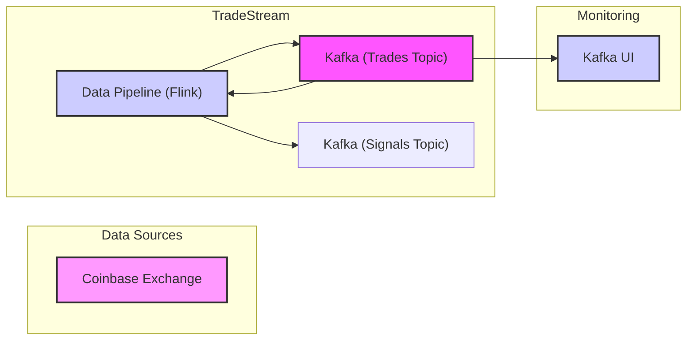

# TradeStream

TradeStream is an algorithmic trading platform that leverages real-time data streams and advanced trading infrastructure. Built with Java, it uses Bazel for builds, Apache Beam and Flink for stream processing, and Kafka for message brokering. The platform is designed for deployment on Kubernetes using Helm charts.

## Overview

TradeStream consists of several key components:

1. **Data Pipeline**: An Apache Beam pipeline running on Apache Flink that processes trade data, computes technical indicators, handles data ingestion, and includes the Strategy Engine which uses Ta4J to evaluate trading strategies
2. **Trade Signals**: Output from the pipeline that can be consumed by an order executor
4. **Kafka**: Message broker for all data streams, running in KRaft mode (Zookeeper-less)
5. **Kafka UI**: Web interface for monitoring Kafka topics
6. **Deployment**: Managed via Helm charts on Kubernetes, with CI/CD through GitHub Actions

### Data Flow



The platform processes data through the following steps:

1. **Data Pipeline**: Connects to Coinbase via WebSocket to stream real-time trade data to Kafka, processes trades, generates technical indicators, evaluates trading strategies using Ta4j, and generates signals
3. **Monitoring**: Provides visibility into data flows through Kafka UI

## Installation

To deploy TradeStream locally:

1. Install `kubectl` and `helm`
2. Set up a Kubernetes cluster (e.g., Minikube)
3. Run:
```bash
helm install my-tradestream charts/tradestream --namespace tradestream-namespace --create-namespace
```

## Configuration

Key configuration parameters in `values.yaml`:

| Parameter | Description | Default |
|-----------|-------------|---------|
| `kafka.replicaCount` | Number of Kafka brokers | 3 |
| `pipeline.runMode` | Pipeline run mode: `wet` (live) or `dry` (simulated) | `wet` |
| `pipeline.version` | Flink version | `v1_18` |

## Project Structure

```
.
├── .github/workflows/         # CI/CD workflows
├── charts/tradestream/        # Helm deployment
├── protos/                    # Protocol Buffers
├── src/main/java/com/verlumen/tradestream/
│   ├── backtesting/          # Backtest implementations
│   ├── execution/            # Run mode and Guice module
│   ├── http/                 # External API clients
│   ├── instruments/          # Financial instruments
│   ├── kafka/                # Kafka utilities
│   ├── marketdata/           # Market data processing
│   ├── pipeline/             # Main Beam pipeline with ingestion and strategies
│   └── strategies/           # Trading strategy definitions
└── platforms/                # Platform configs
```

## CI/CD

The project uses GitHub Actions for:

- Running unit tests (`bazel-test.yaml`)
- Testing Kubernetes deployment (`ci.yaml`)
- Managing releases and Docker images (`release.yaml`)

## Future Development

Planned enhancements include:

- Full backtesting service implementation
- Genetic algorithm optimization service
- Support for additional exchanges
- Expanded trading strategies
- Order execution integration
- Enhanced risk management
- Real-time monitoring and alerting

For more information, questions, or contributions, please open an issue or pull request on GitHub.
