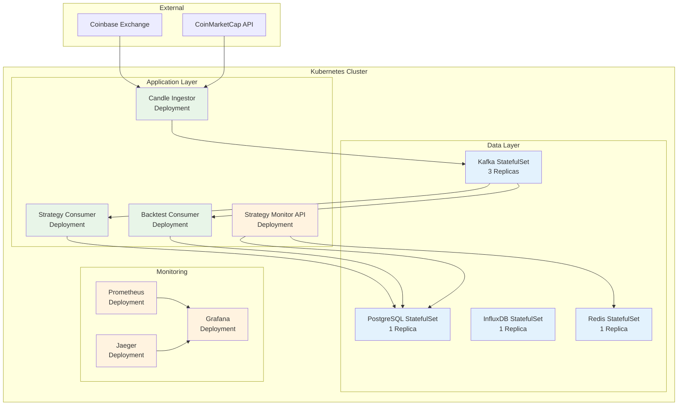
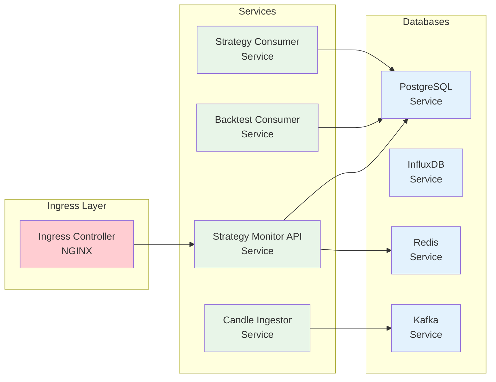

# Kubernetes Charts

This directory contains Helm charts for deploying the TradeStream platform to Kubernetes clusters. The charts provide a complete deployment solution for all services and infrastructure components.

## Production System Overview

- **Status**: PRODUCTION
- **Scale**: 8 microservices, 3-node Kafka cluster
- **Infrastructure**: Kubernetes, Helm, Docker
- **Services**: Data ingestion, processing, storage, monitoring
- **Monitoring**: Prometheus, Grafana, Jaeger

### Kubernetes Deployment Architecture



### Service Discovery and Networking



## Overview

The TradeStream platform is deployed using Kubernetes with Helm charts that provide:

- **Service Deployment**: All microservices with proper configuration
- **Infrastructure**: Databases, message brokers, and monitoring
- **Configuration Management**: Environment-specific configurations
- **Scaling**: Horizontal and vertical scaling capabilities
- **Monitoring**: Health checks, metrics, and logging

## Directory Structure

```
charts/
└── tradestream/
    ├── Chart.yaml          # Chart metadata and dependencies
    ├── values.yaml         # Default configuration values
    └── templates/          # Kubernetes resource templates
        ├── _helpers.tpl    # Common template functions
        ├── services/       # Service deployments
        ├── databases/      # Database deployments
        ├── monitoring/     # Monitoring components
        └── configmaps/     # Configuration management
```

## Architecture

### Service Deployment (✅ Production)

Each service in the TradeStream platform has its own deployment configuration:

- **candle_ingestor**: ✅ **PRODUCTION** - OHLCV data ingestion service (CronJob \*/1 min)
- **strategy_consumer**: ✅ **PRODUCTION** - Strategy consumption and storage (CronJob \*/5 min)
- **strategy_discovery_request_factory**: ✅ **PRODUCTION** - GA request generation (CronJob \*/5 min)
- **strategy_confidence_scorer**: 📝 **READY** - Strategy performance scoring (ready for deployment)
- **strategy_ensemble**: 📋 **PLANNED** - Strategy combination logic
- **strategy_rotation**: 📋 **PLANNED** - Strategy rotation management
- **strategy_time_filter**: ❌ **SKIPPED** - Time-based strategy filtering
- **risk_adjusted_sizing**: 📝 **READY** - Risk management calculations (ready for deployment)
- **strategy_monitor_api**: 🔄 **DEV** - Monitoring REST API (in development)
- **top_crypto_updater**: ✅ **PRODUCTION** - Cryptocurrency list updates (CronJob \*/15 min)

### Infrastructure Components (✅ Production)

- **PostgreSQL**: ✅ **PRODUCTION** - Relational database for strategy storage
- **InfluxDB**: ✅ **PRODUCTION** - Time-series database for market data (365-day retention)
- **Redis**: ✅ **PRODUCTION** - Caching and session storage
- **Kafka**: ✅ **PRODUCTION** - 3-node cluster with KRaft mode for inter-service communication

### Monitoring & Observability

- **Prometheus**: Metrics collection and storage
- **Grafana**: Visualization and dashboards
- **Jaeger**: Distributed tracing
- **Fluentd**: Log aggregation

## Configuration

### Values File Structure

The `values.yaml` file contains configuration for all components:

```yaml
# Global configuration
global:
  environment: production
  domain: tradestream.example.com

# Service configurations
candle_ingestor:
  enabled: true
  replicas: 2
  resources:
    requests:
      memory: "512Mi"
      cpu: "250m"
    limits:
      memory: "1Gi"
      cpu: "500m"

# Database configurations
postgresql:
  enabled: true
  persistence:
    enabled: true
    size: 100Gi

# Monitoring configurations
monitoring:
  prometheus:
    enabled: true
  grafana:
    enabled: true
```

### Environment-Specific Configuration

Create environment-specific values files:

- `values-dev.yaml`: Development environment
- `values-staging.yaml`: Staging environment
- `values-prod.yaml`: Production environment

## Production Deployment

### Current Production Deployment

**Complete TradeStream Stack Deployment**:

```bash
# Deploy complete TradeStream infrastructure and services
helm install tradestream-dev charts/tradestream \
  --namespace tradestream-dev \
  --create-namespace \
  --values charts/tradestream/values.yaml

# Verify successful deployment
kubectl get pods -n tradestream-dev
kubectl get statefulsets -n tradestream-dev
kubectl get cronjobs -n tradestream-dev
kubectl get deployments -n tradestream-dev
```

### Production Service Categories

**StatefulSets** (Data Infrastructure):

```bash
# Core data infrastructure with persistent storage
kubectl get statefulsets -n tradestream-dev

# Expected output:
# tradestream-dev-kafka-controller    3/3     60d   # 3-node Kafka cluster
# tradestream-dev-influxdb           1/1     60d   # Time-series database
# tradestream-dev-postgresql         1/1     60d   # Relational database
# tradestream-dev-redis-master       1/1     60d   # Cache and state
```

**Deployments** (Real-Time Services):

```bash
# 24/7 streaming and processing services
kubectl get deployments -n tradestream-dev

# Expected output:
# tradestream-dev-strategy-discovery-pipeline  1/1     60d   # Flink GA optimization
# tradestream-dev-kafka-ui                    1/1     60d   # Management interface
```

**CronJobs** (Batch Processing):

```bash
# Scheduled data processing and ETL services
kubectl get cronjobs -n tradestream-dev

# Expected output:
# tradestream-dev-candle-ingestor                    */1 * * * *    60d   # Market data
# tradestream-dev-strategy-consumer                  */5 * * * *    60d   # Strategy storage
# tradestream-dev-strategy-discovery-request-factory */5 * * * *    60d   # Pipeline feeding
# tradestream-dev-top-crypto-updater                */15 * * * *    60d   # Symbol management
```

### Portfolio Management Service Deployment

**Deploy Risk Manager** (Ready to execute):

```bash
# Deploy risk management service
helm upgrade tradestream-dev charts/tradestream \
  --namespace tradestream-dev \
  --set portfolio.riskManager.enabled=true

# Verify deployment
kubectl get cronjobs -n tradestream-dev | grep risk-manager
```

**Deploy Position Sizer** (Ready to execute):

```bash
# Deploy position sizing service
helm upgrade tradestream-dev charts/tradestream \
  --namespace tradestream-dev \
  --set portfolio.positionSizer.enabled=true

# Verify deployment
kubectl get cronjobs -n tradestream-dev | grep position-sizer
```

**Deploy Strategy Selector** (Ready to execute):

```bash
# Deploy strategy selection service
helm upgrade tradestream-dev charts/tradestream \
  --namespace tradestream-dev \
  --set portfolio.strategySelector.enabled=true

# Verify deployment
kubectl get cronjobs -n tradestream-dev | grep strategy-selector
```

## Deployment

### Prerequisites

- Kubernetes cluster (1.20+)
- Helm 3.x
- kubectl configured
- Storage classes configured
- Ingress controller installed

### Installation

```bash
# Add the repository
helm repo add tradestream https://charts.tradestream.com

# Install the chart
helm install tradestream charts/tradestream \
  --namespace tradestream \
  --create-namespace \
  --values values-prod.yaml

# Upgrade existing installation
helm upgrade tradestream charts/tradestream \
  --namespace tradestream \
  --values values-prod.yaml
```

### Development Deployment

```bash
# Install with development values
helm install tradestream-dev charts/tradestream \
  --namespace tradestream-dev \
  --create-namespace \
  --values values-dev.yaml

# Port forward for local development
kubectl port-forward svc/strategy-monitor-api 8080:80 -n tradestream-dev
```

## Service Configuration

### Environment Variables

Services are configured through environment variables:

```yaml
candle_ingestor:
  env:
    - name: INFLUXDB_TOKEN
      valueFrom:
        secretKeyRef:
          name: influxdb-secret
          key: token
    - name: REDIS_HOST
      value: "redis-master"
```

### Secrets Management

Sensitive configuration is managed through Kubernetes secrets:

```yaml
# Create secrets
kubectl create secret generic influxdb-secret \
--from-literal=token=your-token \
--namespace tradestream

kubectl create secret generic postgres-secret \
--from-literal=password=your-password \
--namespace tradestream
```

### ConfigMaps

Non-sensitive configuration uses ConfigMaps:

```yaml
# Service-specific configuration
strategy_consumer:
  config:
    kafka_bootstrap_servers: "kafka:9092"
    postgres_host: "postgresql"
    batch_size: 1000
```

## Production Monitoring and Operations

### Service Health Monitoring

```bash
# Check real-time service logs
kubectl logs -n tradestream-dev -f deployment/tradestream-dev-strategy-discovery-pipeline

# Check CronJob execution status and history
kubectl get cronjobs -n tradestream-dev

# Check recent CronJob executions
kubectl get jobs -n tradestream-dev --sort-by=.metadata.creationTimestamp
```

### Data Infrastructure Monitoring

```bash
# Access Kafka UI for topic and consumer monitoring
kubectl port-forward -n tradestream-dev svc/tradestream-dev-kafka-ui 8080:8080
# Open http://localhost:8080 in browser

# List Kafka topics and check message counts
kubectl exec -n tradestream-dev tradestream-dev-kafka-controller-0 -- \
  kafka-topics.sh --bootstrap-server localhost:9092 --list

# Check database connectivity and performance
kubectl exec -n tradestream-dev tradestream-dev-postgresql-0 -- \
  psql -U tradestream -d tradestream -c "SELECT COUNT(*) FROM strategies;"
```

### Performance and Scale Monitoring

```bash
# Check resource usage across all services
kubectl top pods -n tradestream-dev

# Monitor Kafka consumer lag and throughput
kubectl exec -n tradestream-dev tradestream-dev-kafka-controller-0 -- \
  kafka-consumer-groups.sh --bootstrap-server localhost:9092 --describe --all-groups

# Check InfluxDB metrics and storage
kubectl exec -n tradestream-dev tradestream-dev-influxdb-0 -- \
  influx query 'from(bucket:"tradestream-data") |> range(start: -1h) |> count()'
```

## Scaling

### Horizontal Scaling

Services can be scaled horizontally:

```bash
# Scale a service
kubectl scale deployment candle-ingestor --replicas=5 -n tradestream

# Auto-scaling based on metrics
kubectl autoscale deployment strategy-consumer \
  --cpu-percent=70 --min=2 --max=10 -n tradestream
```

### Vertical Scaling

Resource limits can be adjusted:

```yaml
candle_ingestor:
  resources:
    requests:
      memory: "1Gi"
      cpu: "500m"
    limits:
      memory: "2Gi"
      cpu: "1000m"
```

## Monitoring

### Health Checks

All services include health checks:

```yaml
livenessProbe:
  httpGet:
    path: /health
    port: 8080
  initialDelaySeconds: 30
  periodSeconds: 10

readinessProbe:
  httpGet:
    path: /ready
    port: 8080
  initialDelaySeconds: 5
  periodSeconds: 5
```

### Metrics

Services expose Prometheus metrics:

```yaml
annotations:
  prometheus.io/scrape: "true"
  prometheus.io/port: "8080"
  prometheus.io/path: "/metrics"
```

### Logging

Structured logging with correlation IDs:

```yaml
env:
  - name: LOG_LEVEL
    value: "INFO"
  - name: LOG_FORMAT
    value: "json"
```

## Networking

### Ingress Configuration

External access through ingress:

```yaml
ingress:
  enabled: true
  annotations:
    kubernetes.io/ingress.class: nginx
    cert-manager.io/cluster-issuer: letsencrypt-prod
  hosts:
    - host: api.tradestream.example.com
      paths:
        - path: /
          pathType: Prefix
          service:
            name: strategy-monitor-api
            port: 80
  tls:
    - secretName: tradestream-tls
      hosts:
        - api.tradestream.example.com
```

### Service Mesh

Optional Istio integration:

```yaml
istio:
  enabled: true
  sidecar:
    enabled: true
  gateway:
    enabled: true
```

## Backup & Recovery

### Database Backups

Automated backups for databases:

```yaml
postgresql:
  backup:
    enabled: true
    schedule: "0 2 * * *"
    retention: 30
    storage:
      type: s3
      bucket: tradestream-backups
```

### Disaster Recovery

Recovery procedures and configurations:

```yaml
backup:
  enabled: true
  schedule: "0 1 * * *"
  retention: 90
  storage:
    type: s3
    bucket: tradestream-backups
```

## Security

### RBAC Configuration

Role-based access control:

```yaml
rbac:
  enabled: true
  serviceAccount:
    create: true
    annotations: {}
```

### Network Policies

Network isolation:

```yaml
networkPolicy:
  enabled: true
  ingress:
    - from:
        - namespaceSelector:
            matchLabels:
              name: tradestream
```

### Pod Security

Security contexts and policies:

```yaml
securityContext:
  runAsNonRoot: true
  runAsUser: 1000
  fsGroup: 1000
```

## Troubleshooting

### Common Issues

#### Pod Startup Failures

```bash
# Check pod status
kubectl get pods -n tradestream

# Check logs
kubectl logs deployment/candle-ingestor -n tradestream

# Check events
kubectl get events -n tradestream --sort-by='.lastTimestamp'
```

#### Database Connection Issues

```bash
# Check database connectivity
kubectl exec -it deployment/candle-ingestor -n tradestream -- \
  nc -zv postgresql 5432

# Check database logs
kubectl logs deployment/postgresql -n tradestream
```

#### Kafka Connectivity

```bash
# Check Kafka connectivity
kubectl exec -it deployment/strategy-consumer -n tradestream -- \
  nc -zv kafka 9092

# Check Kafka logs
kubectl logs deployment/kafka -n tradestream
```

### Debug Commands

```bash
# Get all resources
kubectl get all -n tradestream

# Describe specific resource
kubectl describe deployment/candle-ingestor -n tradestream

# Port forward for debugging
kubectl port-forward svc/strategy-monitor-api 8080:80 -n tradestream

# Check helm status
helm status tradestream -n tradestream
```

## Development

### Local Development

```bash
# Install with development values
helm install tradestream-dev charts/tradestream \
  --namespace tradestream-dev \
  --create-namespace \
  --values values-dev.yaml

# Port forward services
kubectl port-forward svc/strategy-monitor-api 8080:80 -n tradestream-dev
kubectl port-forward svc/postgresql 5432:5432 -n tradestream-dev
```

### Testing

```bash
# Test chart installation
helm test tradestream -n tradestream

# Validate chart
helm lint charts/tradestream

# Dry run installation
helm install tradestream charts/tradestream \
  --dry-run --debug
```

## Contributing

When contributing to Helm charts:

1. **Follow Patterns**: Use existing template patterns
2. **Add Documentation**: Update README and values.yaml comments
3. **Test Changes**: Test with different environments
4. **Security Review**: Review security implications
5. **Version Compatibility**: Ensure Kubernetes version compatibility

## License

This project is part of the TradeStream platform. See the root LICENSE file for details.
