# Service Architecture

Auto-generated from service source code.

**Total services: 30**

## Service Dependency Graph

```mermaid
graph TB
    subgraph "AI Agents"
        agent_gateway[Agent Gateway]
        learning_engine[Learning Engine]
        opportunity_scorer_agent[Opportunity Scorer Agent]
        orchestrator_agent[Orchestrator Agent]
        signal_generator_agent[Signal Generator Agent]
        strategy_proposer_agent[Strategy Proposer Agent]
    end
    subgraph "Data Ingestion"
        candle_ingestor[Candle Ingestor]
        polymarket_ingestor[Polymarket Ingestor]
        top_crypto_updater[Top Crypto Updater]
    end
    subgraph "Delivery"
        notification_service[Notification Service]
        signal_dashboard[Signal Dashboard]
    end
    subgraph "Evaluation"
        backtesting[Backtesting]
        paper_trading[Paper Trading]
    end
    subgraph "MCP Servers"
        market_mcp[Market Mcp]
        signal_mcp[Signal Mcp]
        strategy_mcp[Strategy Mcp]
    end
    subgraph "Monitoring"
        wallet_anomaly_detector[Wallet Anomaly Detector]
    end
    subgraph "Portfolio & Risk"
        portfolio_api[Portfolio Api]
        portfolio_state[Portfolio State]
        risk_adjusted_sizing[Risk Adjusted Sizing]
    end
    subgraph "REST APIs"
        learning_api[Learning Api]
        market_data_api[Market Data Api]
        strategy_api[Strategy Api]
        strategy_monitor_api[Strategy Monitor Api]
    end
    subgraph "Strategy Discovery"
        strategy_confidence_scorer[Strategy Confidence Scorer]
        strategy_consumer[Strategy Consumer]
        strategy_discovery_request_factory[Strategy Discovery Request Factory]
    end
    subgraph "Strategy Management"
        strategy_ensemble[Strategy Ensemble]
        strategy_rotation[Strategy Rotation]
        strategy_time_filter[Strategy Time Filter]
    end
    subgraph "Infrastructure"
        KAFKA[(Kafka)]
        POSTGRES[(PostgreSQL)]
        REDIS[(Redis)]
        INFLUXDB[(InfluxDB)]
    end
    agent_gateway --> POSTGRES
    agent_gateway --> REDIS
    candle_ingestor --> REDIS
    candle_ingestor --> INFLUXDB
    learning_api --> POSTGRES
    learning_engine --> POSTGRES
    market_data_api --> REDIS
    market_data_api --> INFLUXDB
    market_data_api -.-> market_mcp
    market_mcp --> REDIS
    market_mcp --> INFLUXDB
    notification_service --> REDIS
    paper_trading --> POSTGRES
    portfolio_api --> POSTGRES
    portfolio_state --> POSTGRES
    risk_adjusted_sizing --> POSTGRES
    signal_mcp --> POSTGRES
    signal_mcp --> REDIS
    strategy_api --> POSTGRES
    strategy_confidence_scorer --> POSTGRES
    strategy_consumer --> POSTGRES
    strategy_discovery_request_factory --> KAFKA
    strategy_discovery_request_factory --> REDIS
    strategy_discovery_request_factory --> INFLUXDB
    strategy_ensemble --> POSTGRES
    strategy_mcp --> POSTGRES
    strategy_monitor_api --> POSTGRES
    strategy_rotation --> POSTGRES
    strategy_time_filter --> POSTGRES
    top_crypto_updater --> REDIS
```

## Service Inventory

| Service | Category | Kafka | PostgreSQL | Redis | InfluxDB |
|---------|----------|-------|-----------|-------|----------|
| agent_gateway | AI Agents |  | Y | Y |  |
| backtesting | Evaluation |  |  |  |  |
| candle_ingestor | Data Ingestion |  |  | Y | Y |
| learning_api | REST APIs |  | Y |  |  |
| learning_engine | AI Agents |  | Y |  |  |
| market_data_api | REST APIs |  |  | Y | Y |
| market_mcp | MCP Servers |  |  | Y | Y |
| notification_service | Delivery |  |  | Y |  |
| opportunity_scorer_agent | AI Agents |  |  |  |  |
| orchestrator_agent | AI Agents |  |  |  |  |
| paper_trading | Evaluation |  | Y |  |  |
| polymarket_ingestor | Data Ingestion |  |  |  |  |
| portfolio_api | Portfolio & Risk |  | Y |  |  |
| portfolio_state | Portfolio & Risk |  | Y |  |  |
| risk_adjusted_sizing | Portfolio & Risk |  | Y |  |  |
| signal_dashboard | Delivery |  |  |  |  |
| signal_generator_agent | AI Agents |  |  |  |  |
| signal_mcp | MCP Servers |  | Y | Y |  |
| strategy_api | REST APIs |  | Y |  |  |
| strategy_confidence_scorer | Strategy Discovery |  | Y |  |  |
| strategy_consumer | Strategy Discovery |  | Y |  |  |
| strategy_discovery_request_factory | Strategy Discovery | Y |  | Y | Y |
| strategy_ensemble | Strategy Management |  | Y |  |  |
| strategy_mcp | MCP Servers |  | Y |  |  |
| strategy_monitor_api | REST APIs |  | Y |  |  |
| strategy_proposer_agent | AI Agents |  |  |  |  |
| strategy_rotation | Strategy Management |  | Y |  |  |
| strategy_time_filter | Strategy Management |  | Y |  |  |
| top_crypto_updater | Data Ingestion |  |  | Y |  |
| wallet_anomaly_detector | Monitoring |  |  |  |  |
