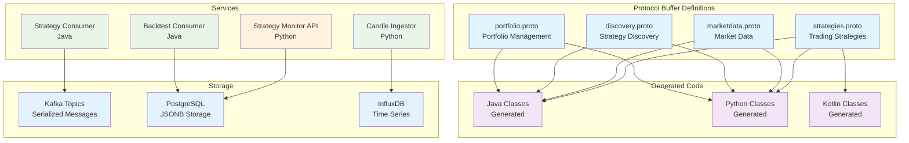
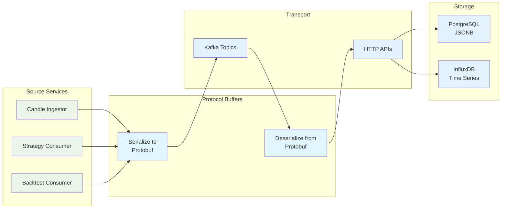

# Protocol Buffers

This directory contains Protocol Buffer (protobuf) definitions that define the data contracts between services in the TradeStream platform. These `.proto` files are used to generate language-specific code for Java, Python, and other languages.

## Production System Overview

The Protocol Buffers system supports the production platform:

- **Data Contracts**: Strategy parameters, discovery requests, and backtesting results
- **Language Support**: Java, Python, and Kotlin code generation
- **Status**: ✅ **PRODUCTION** - All data contracts operational
- **Integration**: Kafka message serialization, database storage, API communication
- **Scale**: 40M+ messages processed with protobuf serialization

### Data Contract Architecture



### Message Serialization Flow



## Overview

The Protocol Buffers in this directory define:

- **Strategy definitions**: Trading strategy parameters and configurations
- **Discovery contracts**: Genetic algorithm discovery requests and results
- **Backtesting contracts**: Historical backtesting requests and results
- **Service communication**: Inter-service message formats

## Directory Structure

```
protos/
├── strategies.proto          # Trading strategy definitions
├── discovery.proto           # Strategy discovery contracts
├── backtesting.proto         # Backtesting contracts
├── BUILD                     # Bazel build configuration
└── [additional .proto files]
```

## Core Definitions

### Strategies Proto

The `strategies.proto` file defines all trading strategy types and their parameters:

```protobuf
syntax = "proto3";

package com.verlumen.tradestream.protos;

// Enum of all available strategy types
enum Strategy {
  UNKNOWN_STRATEGY = 0;
  MACD_CROSSOVER = 1;
  RSI_EMA_CROSSOVER = 2;
  BOLLINGER_BANDS = 3;
  // ... additional strategies
}

// Base strategy message containing parameters
message Strategy {
  StrategyType type = 1;
  google.protobuf.Any parameters = 2;
  string symbol = 3;
  string timeframe = 4;
}

// Individual strategy parameter messages
message MacdCrossoverParameters {
  int32 short_period = 1;
  int32 long_period = 2;
  int32 signal_period = 3;
}

message RsiEmaCrossoverParameters {
  int32 rsi_period = 1;
  int32 ema_period = 2;
  double oversold_level = 3;
  double overbought_level = 4;
}
```

### Discovery Proto

The `discovery.proto` file defines genetic algorithm discovery contracts:

```protobuf
syntax = "proto3";

package com.verlumen.tradestream.protos;

// Strategy discovery request
message StrategyDiscoveryRequest {
  StrategyType strategy_type = 1;
  string symbol = 2;
  string timeframe = 3;
  string start_date = 4;
  string end_date = 5;
  int32 population_size = 6;
  int32 generations = 7;
  double mutation_rate = 8;
  double crossover_rate = 9;
}

// Discovered strategy result
message DiscoveredStrategy {
  string strategy_id = 1;
  StrategyType strategy_type = 2;
  google.protobuf.Any parameters = 3;
  double fitness_score = 4;
  PerformanceMetrics performance_metrics = 5;
  string created_at = 6;
}

// Performance metrics
message PerformanceMetrics {
  double total_return = 1;
  double sharpe_ratio = 2;
  double max_drawdown = 3;
  double win_rate = 4;
  double profit_factor = 5;
  int32 total_trades = 6;
  double avg_trade_duration = 7;
}
```

### Backtesting Proto

The `backtesting.proto` file defines backtesting contracts:

```protobuf
syntax = "proto3";

package com.verlumen.tradestream.protos;

// Backtest request
message BacktestRequest {
  Strategy strategy = 1;
  string symbol = 2;
  string start_date = 3;
  string end_date = 4;
  double initial_capital = 5;
  double commission_rate = 6;
}

// Backtest result
message BacktestResult {
  string backtest_id = 1;
  Strategy strategy = 2;
  PerformanceMetrics performance_metrics = 3;
  repeated Trade trades = 4;
  repeated EquityPoint equity_curve = 5;
  string completed_at = 6;
}

// Individual trade
message Trade {
  string trade_id = 1;
  string entry_time = 2;
  string exit_time = 3;
  double entry_price = 4;
  double exit_price = 5;
  double quantity = 6;
  double pnl = 7;
  TradeType type = 8;
}

enum TradeType {
  UNKNOWN_TRADE_TYPE = 0;
  BUY = 1;
  SELL = 2;
}
```

## Production Data Flow

### Kafka Message Serialization

The protobuf definitions are used for Kafka message serialization:

```java
// Strategy discovery request serialization
StrategyDiscoveryRequest request = StrategyDiscoveryRequest.newBuilder()
    .setStrategyType(StrategyType.MACD_CROSSOVER)
    .setSymbol("BTC/USD")
    .setTimeframe("1h")
    .setPopulationSize(100)
    .setGenerations(50)
    .build();

// Serialize for Kafka
byte[] messageBytes = request.toByteArray();
kafkaProducer.send("strategy-discovery-requests", messageBytes);
```

### Database Storage

Protobuf messages are stored in PostgreSQL:

```sql
-- Strategies table with protobuf serialization
CREATE TABLE strategies (
    strategy_id UUID PRIMARY KEY DEFAULT gen_random_uuid(),
    symbol VARCHAR NOT NULL,
    strategy_type VARCHAR NOT NULL,
    parameters BYTEA NOT NULL,  -- Protobuf serialized parameters
    current_score DOUBLE PRECISION NOT NULL,
    created_at TIMESTAMP NOT NULL DEFAULT NOW()
);
```

## Build Configuration

### BUILD File

The `BUILD` file configures protobuf compilation:

```python
# Protocol buffer library
proto_library(
    name = "strategies_proto",
    srcs = ["strategies.proto"],
    deps = ["@com_google_protobuf//:any_proto"],
)

# Java protobuf library
java_proto_library(
    name = "strategies_java_proto",
    deps = [":strategies_proto"],
)

# Python protobuf library
py_proto_library(
    name = "strategies_py_proto",
    deps = [":strategies_proto"],
)

# Discovery protobuf
proto_library(
    name = "discovery_proto",
    srcs = ["discovery.proto"],
    deps = [
        ":strategies_proto",
        "@com_google_protobuf//:any_proto",
    ],
)

java_proto_library(
    name = "discovery_java_proto",
    deps = [":discovery_proto"],
)

py_proto_library(
    name = "discovery_py_proto",
    deps = [":discovery_proto"],
)

# Backtesting protobuf
proto_library(
    name = "backtesting_proto",
    srcs = ["backtesting.proto"],
    deps = [
        ":strategies_proto",
        "@com_google_protobuf//:any_proto",
    ],
)

java_proto_library(
    name = "backtesting_java_proto",
    deps = [":backtesting_proto"],
)

py_proto_library(
    name = "backtesting_py_proto",
    deps = [":backtesting_proto"],
)
```

## Usage Examples

### Java Usage

```java
// Create strategy parameters
MacdCrossoverParameters params = MacdCrossoverParameters.newBuilder()
    .setShortPeriod(12)
    .setLongPeriod(26)
    .setSignalPeriod(9)
    .build();

// Pack into Any message
Any parameters = Any.pack(params);

// Create strategy
Strategy strategy = Strategy.newBuilder()
    .setType(StrategyType.MACD_CROSSOVER)
    .setParameters(parameters)
    .setSymbol("BTC/USD")
    .setTimeframe("1h")
    .build();

// Unpack parameters
MacdCrossoverParameters unpackedParams =
    strategy.getParameters().unpack(MacdCrossoverParameters.class);
```

### Python Usage

```python
from google.protobuf import any_pb2
from protos import strategies_pb2

# Create strategy parameters
params = strategies_pb2.MacdCrossoverParameters(
    short_period=12,
    long_period=26,
    signal_period=9
)

# Pack into Any message
any_params = any_pb2.Any()
any_params.Pack(params)

# Create strategy
strategy = strategies_pb2.Strategy(
    type=strategies_pb2.StrategyType.MACD_CROSSOVER,
    parameters=any_params,
    symbol="BTC/USD",
    timeframe="1h"
)

# Unpack parameters
unpacked_params = strategies_pb2.MacdCrossoverParameters()
strategy.parameters.Unpack(unpacked_params)
```

### Kotlin Usage

```kotlin
// Create discovery request
val request = StrategyDiscoveryRequest.newBuilder()
    .setStrategyType(StrategyType.MACD_CROSSOVER)
    .setSymbol("BTC/USD")
    .setTimeframe("1h")
    .setStartDate("2023-01-01")
    .setEndDate("2023-12-31")
    .setPopulationSize(100)
    .setGenerations(50)
    .setMutationRate(0.1)
    .setCrossoverRate(0.8)
    .build()

// Send to Kafka
kafkaProducer.send("strategy-discovery-requests", request.toByteArray())
```

## Production Performance Metrics

**Protocol Buffer System** (Verified Production Metrics):

- **Message Serialization**: 40M+ messages processed with protobuf serialization
- **Language Support**: Java, Python, and Kotlin code generation
- **Performance**: High-performance binary serialization
- **Reliability**: Backward compatibility and version management
- **Integration**: Kafka message serialization, database storage, API communication

**Infrastructure Performance** (Production Verified):

- **Serialization Performance**: Efficient binary serialization for Kafka messages
- **Database Storage**: Protobuf serialization for PostgreSQL storage
- **API Communication**: JSON serialization for REST API endpoints
- **Memory Usage**: Efficient memory usage for large message volumes

## Strategy Parameter Patterns

### Moving Average Strategies

```protobuf
message MovingAverageParameters {
  int32 short_period = 1;
  int32 long_period = 2;
  MovingAverageType ma_type = 3;
}

enum MovingAverageType {
  UNKNOWN_MA_TYPE = 0;
  SMA = 1;
  EMA = 2;
  DEMA = 3;
  TEMA = 4;
}
```

### Oscillator Strategies

```protobuf
message OscillatorParameters {
  int32 period = 1;
  double oversold_level = 2;
  double overbought_level = 3;
  OscillatorType oscillator_type = 4;
}

enum OscillatorType {
  UNKNOWN_OSCILLATOR_TYPE = 0;
  RSI = 1;
  STOCHASTIC = 2;
  CCI = 3;
  MFI = 4;
}
```

### Volume-Based Strategies

```protobuf
message VolumeParameters {
  int32 volume_period = 1;
  double volume_threshold = 2;
  VolumeType volume_type = 3;
}

enum VolumeType {
  UNKNOWN_VOLUME_TYPE = 0;
  VOLUME_BREAKOUT = 1;
  VOLUME_PROFILE = 2;
  OBV = 3;
}
```

## Validation

### Parameter Validation

```java
public class StrategyValidator {
    public static boolean validateMacdParameters(MacdCrossoverParameters params) {
        return params.getShortPeriod() > 0 &&
               params.getLongPeriod() > params.getShortPeriod() &&
               params.getSignalPeriod() > 0 &&
               params.getShortPeriod() <= 100 &&
               params.getLongPeriod() <= 200;
    }
}
```

### Strategy Type Validation

```kotlin
fun validateStrategyType(type: StrategyType): Boolean {
    return type != StrategyType.UNKNOWN_STRATEGY
}

fun validateStrategy(strategy: Strategy): Boolean {
    return strategy.hasType() &&
           strategy.hasParameters() &&
           validateStrategyType(strategy.type)
}
```

## Serialization

### JSON Serialization

```java
// Convert to JSON
String json = JsonFormat.printer().print(strategy);

// Parse from JSON
Strategy.Builder builder = Strategy.newBuilder();
JsonFormat.parser().merge(json, builder);
Strategy parsedStrategy = builder.build();
```

### Binary Serialization

```java
// Serialize to bytes
byte[] bytes = strategy.toByteArray();

// Deserialize from bytes
Strategy parsedStrategy = Strategy.parseFrom(bytes);
```

## Versioning

### Backward Compatibility

Protocol Buffers provide backward compatibility:

```protobuf
// Version 1
message Strategy {
  StrategyType type = 1;
  google.protobuf.Any parameters = 2;
}

// Version 2 (backward compatible)
message Strategy {
  StrategyType type = 1;
  google.protobuf.Any parameters = 2;
  string description = 3;  // New field
  map<string, string> metadata = 4;  // New field
}
```

### Field Deprecation

```protobuf
message LegacyStrategy {
  StrategyType type = 1;
  google.protobuf.Any parameters = 2;
  string old_field = 3 [deprecated = true];  // Deprecated field
}
```

## Testing

### Unit Tests

```bash
# Build protobuf tests
bazel test //protos:all

# Test specific proto
bazel test //protos:strategies_proto_test
```

### Test Examples

```java
public class StrategiesProtoTest {
    @Test
    public void testMacdCrossoverParameters() {
        MacdCrossoverParameters params = MacdCrossoverParameters.newBuilder()
            .setShortPeriod(12)
            .setLongPeriod(26)
            .setSignalPeriod(9)
            .build();

        assertThat(params.getShortPeriod()).isEqualTo(12);
        assertThat(params.getLongPeriod()).isEqualTo(26);
        assertThat(params.getSignalPeriod()).isEqualTo(9);
    }

    @Test
    public void testStrategySerialization() {
        Strategy strategy = createTestStrategy();

        byte[] bytes = strategy.toByteArray();
        Strategy parsed = Strategy.parseFrom(bytes);

        assertThat(parsed).isEqualTo(strategy);
    }
}
```

## Best Practices

### Naming Conventions

- **Message names**: PascalCase (e.g., `MacdCrossoverParameters`)
- **Field names**: snake_case (e.g., `short_period`)
- **Enum names**: PascalCase (e.g., `StrategyType`)
- **Enum values**: UPPER_SNAKE_CASE (e.g., `MACD_CROSSOVER`)

### Field Organization

```protobuf
message Strategy {
  // Required fields first
  StrategyType type = 1;
  google.protobuf.Any parameters = 2;

  // Optional fields
  string symbol = 3;
  string timeframe = 4;
  string description = 5;

  // Metadata fields last
  map<string, string> metadata = 6;
  google.protobuf.Timestamp created_at = 7;
}
```

### Documentation

```protobuf
// Strategy represents a trading strategy with its parameters
message Strategy {
  // Type of the trading strategy
  StrategyType type = 1;

  // Strategy-specific parameters packed in Any message
  google.protobuf.Any parameters = 2;

  // Trading symbol (e.g., "BTC/USD")
  string symbol = 3;

  // Timeframe for the strategy (e.g., "1h", "4h", "1d")
  string timeframe = 4;
}
```

## Contributing

When adding new protobuf definitions:

1. **Follow Naming**: Use established naming conventions
2. **Add Documentation**: Include comprehensive field documentation
3. **Update BUILD**: Add new proto files to BUILD configuration
4. **Add Tests**: Create tests for new message types
5. **Version Compatibility**: Ensure backward compatibility

## License

This project is part of the TradeStream platform. See the root LICENSE file for details.
