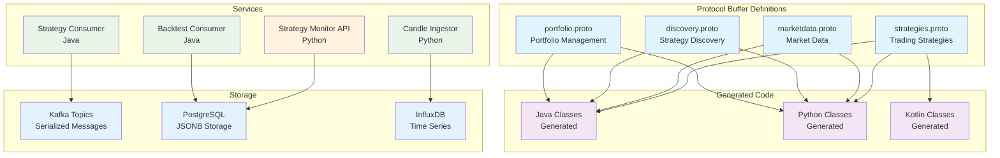

# Protocol Buffers

This directory contains Protocol Buffer (protobuf) definitions that define the data contracts between services in the TradeStream platform. These `.proto` files are used to generate language-specific code for Java, Python, and other languages.

## Production System Overview

The Protocol Buffers system supports the production platform:

- **Data Contracts**: Strategy parameters, discovery requests, and backtesting results
- **Language Support**: Java, Python, and Kotlin code generation
- **Status**: ✅ **PRODUCTION** - All data contracts operational
- **Integration**: Kafka message serialization, database storage, API communication
- **Scale**: 40M+ messages processed with protobuf serialization

### Data Contract Architecture



## Directory Structure

```
protos/
├── strategies.proto          # Trading strategy definitions
├── discovery.proto           # Strategy discovery contracts
├── backtesting.proto         # Backtesting contracts
├── BUILD                     # Bazel build configuration
└── [additional .proto files]
```

## Core Definitions

### Strategies Proto

The `strategies.proto` file defines trading strategy messages and their parameter types.

**Key Design**: Strategies use **string-based identification** via the `strategy_name` field. Strategy specifications are defined in YAML configuration files and loaded at runtime via `StrategyRegistry`.

```protobuf
syntax = "proto3";

package strategies;

import "google/protobuf/any.proto";

// Strategy message containing parameters and identification
message Strategy {
  // Reserved: Field 1 was previously StrategyType enum (deprecated and removed)
  reserved 1;
  reserved "type";

  // Strategy-specific parameters packed in Any message
  google.protobuf.Any parameters = 2;

  // String-based strategy identifier (e.g., "MACD_CROSSOVER", "SMA_RSI")
  // This is the primary field for identifying strategies.
  string strategy_name = 3;
}

// Individual strategy parameter messages
message MacdCrossoverParameters {
  int32 shortEmaPeriod = 1;
  int32 longEmaPeriod = 2;
  int32 signalPeriod = 3;
}

message SmaEmaCrossoverParameters {
  int32 smaPeriod = 1;
  int32 emaPeriod = 2;
}

// ... additional parameter messages for each strategy type
```

### Discovery Proto

The `discovery.proto` file defines genetic algorithm discovery contracts:

```protobuf
syntax = "proto3";

package discovery;

import "google/protobuf/timestamp.proto";
import "protos/strategies.proto";

// Configuration for Genetic Algorithm based optimization
message GAConfig {
  int32 max_generations = 1;
  int32 population_size = 2;
}

// Strategy discovery request
message StrategyDiscoveryRequest {
  string symbol = 1;                        // Trading symbol (e.g., "BTCUSDT")
  google.protobuf.Timestamp start_time = 2; // Inclusive start time
  google.protobuf.Timestamp end_time = 3;   // Exclusive end time

  // Reserved: Field 4 was previously StrategyType enum (deprecated and removed)
  reserved 4;
  reserved "strategy_type";

  int32 top_n = 5;                          // Number of top strategies to return

  oneof optimization_config {
    GAConfig ga_config = 6;
  }

  // String-based strategy name identifier (e.g., "MACD_CROSSOVER")
  string strategy_name = 8;
}

// Discovered strategy result
message DiscoveredStrategy {
  strategies.Strategy strategy = 1;
  double score = 2;
  string symbol = 3;
  google.protobuf.Timestamp start_time = 4;
  google.protobuf.Timestamp end_time = 5;
}
```

## Strategy Configuration System

Strategies are defined in YAML configuration files and loaded at runtime. This enables:

- **Dynamic strategy addition** without code changes
- **Runtime discovery** via `StrategyRegistry`
- **Config-driven parameters** with validation ranges

### YAML Strategy Format

Strategy definitions live in `src/main/resources/strategies/`:

```yaml
# Example: macd_crossover.yaml
name: MACD_CROSSOVER
description: MACD crosses Signal Line
complexity: SIMPLE
parameterMessageType: com.verlumen.tradestream.strategies.MacdCrossoverParameters

indicators:
  - id: macd
    type: MACD
    input: close
    params:
      shortPeriod: "${shortEmaPeriod}"
      longPeriod: "${longEmaPeriod}"
  - id: signal
    type: EMA
    input: macd
    params:
      period: "${signalPeriod}"

entryConditions:
  - type: CROSSED_UP
    indicator: macd
    params:
      crosses: signal

exitConditions:
  - type: CROSSED_DOWN
    indicator: macd
    params:
      crosses: signal

parameters:
  - name: shortEmaPeriod
    type: INTEGER
    min: 8
    max: 16
    defaultValue: 12
  - name: longEmaPeriod
    type: INTEGER
    min: 20
    max: 32
    defaultValue: 26
  - name: signalPeriod
    type: INTEGER
    min: 5
    max: 12
    defaultValue: 9
```

### StrategyRegistry

The `StrategyRegistry` provides runtime strategy lookup:

```kotlin
// Load all strategies from classpath
val registry = StrategyRegistry.fromClasspath("/strategies")

// Get a specific strategy
val spec = registry.getSpec("MACD_CROSSOVER")

// Check if a strategy exists
val isSupported = registry.isSupported("MACD_CROSSOVER")

// List all available strategies
val names = registry.getSupportedStrategyNames()
```

## Usage Examples

### Java Usage

```java
// Create strategy parameters
MacdCrossoverParameters params = MacdCrossoverParameters.newBuilder()
    .setShortEmaPeriod(12)
    .setLongEmaPeriod(26)
    .setSignalPeriod(9)
    .build();

// Pack into Any message
Any parameters = Any.pack(params);

// Create strategy with string-based identification
Strategy strategy = Strategy.newBuilder()
    .setStrategyName("MACD_CROSSOVER")
    .setParameters(parameters)
    .build();

// Unpack parameters
MacdCrossoverParameters unpackedParams =
    strategy.getParameters().unpack(MacdCrossoverParameters.class);
```

### Python Usage

```python
from google.protobuf import any_pb2
from protos import strategies_pb2

# Create strategy parameters
params = strategies_pb2.MacdCrossoverParameters(
    shortEmaPeriod=12,
    longEmaPeriod=26,
    signalPeriod=9
)

# Pack into Any message
any_params = any_pb2.Any()
any_params.Pack(params)

# Create strategy
strategy = strategies_pb2.Strategy(
    strategy_name="MACD_CROSSOVER",
    parameters=any_params
)

# Unpack parameters
unpacked_params = strategies_pb2.MacdCrossoverParameters()
strategy.parameters.Unpack(unpacked_params)
```

### Kotlin Usage

```kotlin
// Create discovery request
val request = StrategyDiscoveryRequest.newBuilder()
    .setStrategyName("MACD_CROSSOVER")
    .setSymbol("BTC/USD")
    .setStartTime(startTimestamp)
    .setEndTime(endTimestamp)
    .setTopN(10)
    .setGaConfig(GAConfig.newBuilder()
        .setPopulationSize(100)
        .setMaxGenerations(50)
        .build())
    .build()

// Send to Kafka
kafkaProducer.send("strategy-discovery-requests", request.toByteArray())
```

## Build Configuration

### BUILD File

```python
# Protocol buffer library
proto_library(
    name = "strategies_proto",
    srcs = ["strategies.proto"],
    deps = ["@com_google_protobuf//:any_proto"],
)

# Java protobuf library
java_proto_library(
    name = "strategies_java_proto",
    deps = [":strategies_proto"],
)

# Python protobuf library
py_proto_library(
    name = "strategies_py_proto",
    deps = [":strategies_proto"],
)

# Discovery protobuf
proto_library(
    name = "discovery_proto",
    srcs = ["discovery.proto"],
    deps = [
        ":strategies_proto",
        "@com_google_protobuf//:any_proto",
        "@com_google_protobuf//:timestamp_proto",
    ],
)
```

## Production Performance Metrics

**Protocol Buffer System** (Verified Production Metrics):

- **Message Serialization**: 40M+ messages processed with protobuf serialization
- **Language Support**: Java, Python, and Kotlin code generation
- **Performance**: High-performance binary serialization
- **Reliability**: Backward compatibility and version management
- **Integration**: Kafka message serialization, database storage, API communication

## Best Practices

### Naming Conventions

- **Message names**: PascalCase (e.g., `MacdCrossoverParameters`)
- **Field names**: camelCase for consistency with existing code (e.g., `shortEmaPeriod`)
- **Strategy names**: UPPER_SNAKE_CASE (e.g., `MACD_CROSSOVER`)

### Adding New Strategy Parameters

1. Add a new `*Parameters` message to `strategies.proto`
2. Create corresponding YAML file in `src/main/resources/strategies/`
3. Include `parameterMessageType` field pointing to the fully-qualified proto class
4. Run `bazel build //protos:strategies_java_proto` to regenerate bindings

### Field Deprecation

When deprecating fields, use the `reserved` keyword to prevent field number reuse:

```protobuf
message Strategy {
  // Reserved to maintain wire compatibility
  reserved 1;
  reserved "type";

  // Current fields
  google.protobuf.Any parameters = 2;
  string strategy_name = 3;
}
```

## Testing

```bash
# Build all protobuf targets
bazel build //protos:all

# Run tests
bazel test //protos:all
```

## Contributing

When adding new protobuf definitions:

1. **Follow Naming**: Use established naming conventions
2. **Add Documentation**: Include comprehensive field documentation
3. **Update BUILD**: Add new proto files to BUILD configuration
4. **Add YAML Config**: Create strategy YAML file with `parameterMessageType`
5. **Version Compatibility**: Use `reserved` for removed fields

## License

This project is part of the TradeStream platform. See the root LICENSE file for details.
