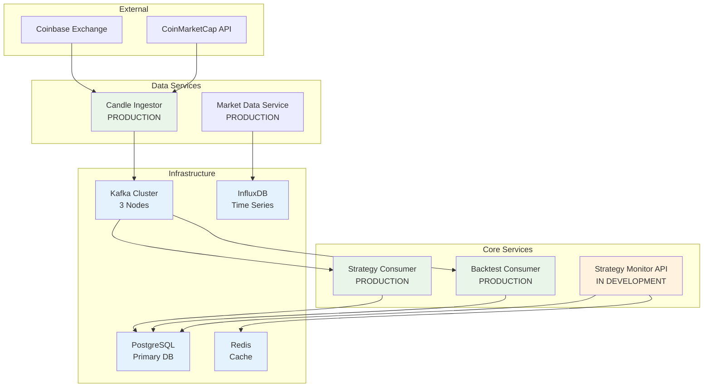
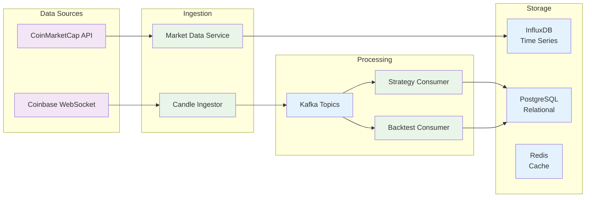

# Services

This directory contains all the microservices that make up the TradeStream algorithmic trading platform. Each service is designed to be stateless, containerized, and independently deployable.

## Production System Overview

- **Status**: PRODUCTION
- **Scale**: 40M+ strategy discoveries, 240+ days uptime
- **Services**: 8 microservices deployed
- **Infrastructure**: Kubernetes, Helm, Docker
- **Monitoring**: Prometheus, Grafana, Jaeger

### Service Architecture



### Data Flow Architecture



## Architecture Overview

The TradeStream platform follows a hybrid Python + Java microservices architecture with the following key components:

### Data Ingestion Services (✅ Production)
- **candle_ingestor**: Real-time market data ingestion from Coinbase WebSocket API
  - **Scale**: 1000+ candles per minute across 20 cryptocurrency symbols
  - **Deployment**: Kubernetes CronJob (*/1 minute)
  - **Status**: ✅ **PRODUCTION** - Processing with automatic catch-up processing
- **top_crypto_updater**: Maintains list of actively traded cryptocurrency symbols
  - **Integration**: CoinMarketCap API for real-time rankings
  - **Deployment**: Kubernetes CronJob (*/15 minutes)
  - **Status**: ✅ **PRODUCTION** - Managing 20 active symbols via Redis

### Strategy Discovery Services (✅ Production)
- **strategy_discovery_request_factory**: Generates strategy discovery requests for Flink GA pipeline
  - **Scale**: 9,600 requests per execution, 40M+ total requests processed
  - **Deployment**: Kubernetes CronJob (*/5 minutes)
  - **Status**: ✅ **PRODUCTION** - Successfully feeding real-time genetic algorithm optimization
- **strategy_consumer**: Stores discovered strategies from Flink pipeline in PostgreSQL
  - **Scale**: Processing all strategies discovered by genetic algorithm optimization
  - **Deployment**: Kubernetes CronJob (*/5 minutes)
  - **Status**: ✅ **PRODUCTION** - Complete strategy metadata storage

### Portfolio Management Services (🔄 Ready for Deployment)
- **risk_adjusted_sizing**: Portfolio risk controls and position limits
  - **Features**: Maximum 2% portfolio risk per position, symbol exposure limits
  - **Deployment**: Kubernetes CronJob (*/1 minute) - recommended pattern
  - **Status**: 📝 **CODE COMPLETE** - Ready for deployment
- **strategy_confidence_scorer**: Basic confidence scoring and strategy selection
  - **Features**: Performance, frequency, and recency-based scoring
  - **Deployment**: Kubernetes CronJob (*/5 minutes)
  - **Status**: 📝 **CODE COMPLETE** - Ready for deployment
- **strategy_ensemble**: Strategy combination and diversification
  - **Status**: 📋 **PLANNED** - Future enhancement
- **strategy_rotation**: Strategy rotation based on market conditions
  - **Status**: 📋 **PLANNED** - Future enhancement
- **strategy_time_filter**: Time-based strategy filtering
  - **Status**: ❌ **SKIPPED** - Redundant with real-time GA optimization

### Monitoring & API Services (🔄 In Development)
- **strategy_monitor_api**: REST API for monitoring and managing trading strategies
  - **Technology**: FastAPI with JWT authentication
  - **Features**: Strategy data endpoints, real-time monitoring
  - **Status**: 🔄 **IN DEVELOPMENT** - Codebase ready, pending deployment

## Technology Stack

- **Language**: Python 3.13 for data engineering and portfolio management
- **Build System**: Bazel 7.4.0
- **Containerization**: Docker with OCI-compliant images
- **Message Broker**: Apache Kafka (3-node cluster with KRaft mode)
- **Databases**: 
  - PostgreSQL (strategy metadata and portfolio data)
  - InfluxDB (time-series market data with 365-day retention)
  - Redis (symbol management and processing state)
- **Deployment**: Kubernetes with Helm charts
- **Monitoring**: Prometheus, Grafana, structured logging

## Production Data Flow

1. **Market Data Ingestion**: Coinbase WebSocket → `candle_ingestor` → InfluxDB + Kafka events
2. **Strategy Discovery**: `strategy_discovery_request_factory` → Kafka → Flink GA Pipeline → Discovered Strategies  
3. **Portfolio Management**: Risk Manager → Position Sizer → Strategy Selector → Trade Signals
4. **Trade Execution**: Trade Executor → Exchange APIs → Order Management

## Development

### Building All Services
```bash
bazel build //services/...
```

### Running Tests
```bash
bazel test //services/...
```

### Building Individual Service
```bash
bazel build //services/candle_ingestor:all
```

### Running Service Locally
```bash
bazel run //services/candle_ingestor:main
```

## Deployment

All services are deployed to Kubernetes using Helm charts located in `charts/tradestream/`. Each service has its own configuration section in `values.yaml`.

### Service Configuration

Each service can be configured via:
- Environment variables
- Command-line flags
- Kubernetes ConfigMaps/Secrets
- Helm chart values

### Production Deployment Status

**✅ Deployed & Operating**:
- `candle_ingestor`: Processing 1000+ candles/minute across 20 cryptocurrency symbols
- `strategy_consumer`: Storing all discovered strategies in PostgreSQL with full metadata
- `strategy_discovery_request_factory`: Generated 40M+ optimization requests to Flink pipeline
- `top_crypto_updater`: Managing 20 active cryptocurrency symbols via Redis using CoinMarketCap API

**🔄 Ready for Deployment**:
- `risk_adjusted_sizing`: Portfolio risk controls and position limits
- `strategy_confidence_scorer`: Basic confidence scoring and strategy selection
- `strategy_monitor_api`: REST API for strategy data access and visualization

### Monitoring

Services expose metrics and health checks for monitoring:
- Prometheus metrics endpoints
- Kubernetes liveness/readiness probes
- Structured logging with correlation IDs
- Real-time performance metrics

## Service Communication

Services communicate through:
- **Kafka**: Asynchronous messaging for strategy discovery and execution
  - Topics: `strategy-discovery-requests`, `discovered-strategies`, `risk-approved-strategies`, `sized-positions`, `trade-signals`
- **HTTP/REST**: Synchronous communication for API calls
- **Database**: Shared state through PostgreSQL and InfluxDB

## Directory Structure

```
services/
├── candle_ingestor/                    # ✅ PRODUCTION - OHLCV data ingestion
├── strategy_consumer/                  # ✅ PRODUCTION - Strategy consumption and storage
├── strategy_discovery_request_factory/ # ✅ PRODUCTION - GA request generation
├── strategy_confidence_scorer/         # 📝 READY - Strategy performance scoring
├── strategy_ensemble/                  # 📋 PLANNED - Strategy combination logic
├── strategy_rotation/                  # 📋 PLANNED - Strategy rotation management
├── strategy_time_filter/               # ❌ SKIPPED - Time-based strategy filtering
├── risk_adjusted_sizing/              # 📝 READY - Risk management calculations
├── strategy_monitor_api/              # 🔄 DEV - Monitoring REST API
└── top_crypto_updater/               # ✅ PRODUCTION - Cryptocurrency list updates
```

## Production Performance Metrics

**Strategy Discovery System** (Verified Production Metrics):
- **Strategy Discoveries**: 40+ million requests processed successfully
- **System Uptime**: 240+ days continuous operation with automatic recovery
- **Market Data Processing**: 1000+ candles per minute ingestion rate
- **Symbol Coverage**: 20 cryptocurrency pairs actively monitored and processed
- **Reliability**: Automatic restart and catchup processing (currently attempt #1400+)
- **Throughput**: 9,600 discovery requests per 5-minute execution cycle

**Infrastructure Performance** (Production Verified):
- **Kafka Throughput**: 40M+ messages successfully processed
- **Database Performance**: Sub-second strategy queries and inserts
- **Storage Efficiency**: Compressed time-series data with 365-day retention
- **Memory Usage**: Efficient Redis caching with minimal memory footprint

## Contributing

When adding a new service:

1. Create the service directory with required files
2. Add BUILD file with appropriate targets
3. Include container-structure-test.yaml for validation
4. Add service configuration to charts/tradestream/values.yaml
5. Update CI/CD pipelines in .github/workflows/
6. Add comprehensive tests
7. Update this README with service description

## Testing

Each service includes:
- Unit tests
- Integration tests
- Container structure tests
- End-to-end tests where applicable

Run tests for all services:
```bash
bazel test //services/...
```

## License

This project is part of the TradeStream platform. See the root LICENSE file for details. 