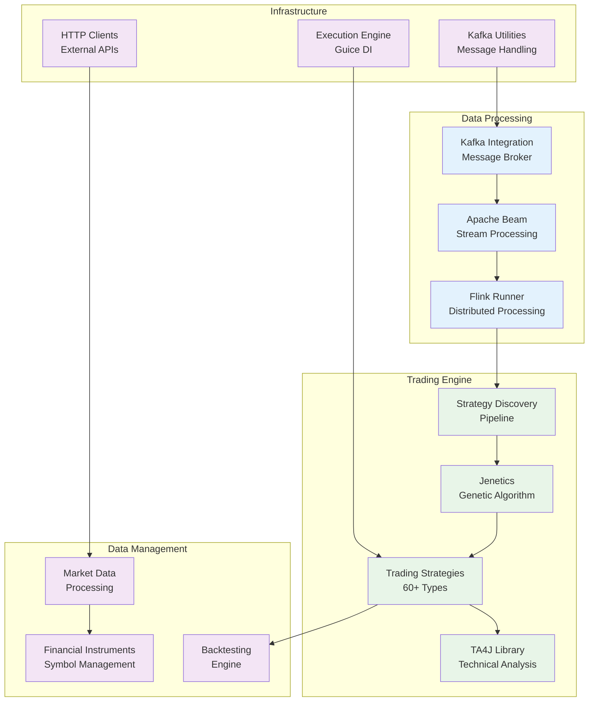
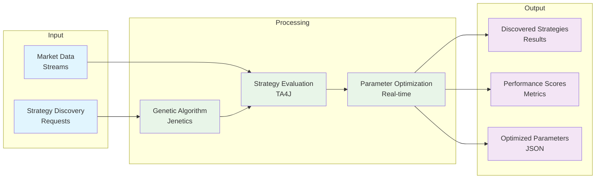

# Source Code

This directory contains the core Java and Kotlin backend code for the TradeStream algorithmic trading platform. The code is organized into logical modules that handle different aspects of the trading system.

## Production System Overview

- **Status**: PRODUCTION
- **Scale**: 40M+ requests processed, 240+ days uptime
- **Technology**: Java 17, Kotlin 1.9, Apache Beam, Flink
- **Strategies**: 60+ strategy types, Jenetics genetic algorithm
- **Performance**: Real-time streaming with sub-second latency

### Core Architecture



### Strategy Discovery Pipeline



## Architecture Overview

The source code implements a hybrid Python + Java architecture where Java handles the high-performance core processing:

### Core Trading Components (✅ Production)
- **strategies/**: Trading strategy implementations using TA4J library
  - **Scale**: 60 different technical analysis strategies implemented
  - **Technology**: TA4J indicators and rules (CrossedUpIndicatorRule, OverIndicatorRule, etc.)
  - **Status**: ✅ **PRODUCTION** - All strategies operational in genetic algorithm optimization
- **discovery/**: Genetic algorithm-based strategy discovery and optimization
  - **Scale**: 40M+ strategy discovery requests processed successfully
  - **Technology**: Apache Beam + Flink, Jenetics library, Jenetics genetic algorithm
  - **Status**: ✅ **PRODUCTION** - Real-time GA optimization (attempt #1400+ with auto-recovery)
- **backtesting/**: Historical strategy backtesting framework
  - **Status**: ✅ **PRODUCTION** - Backtesting capabilities operational
- **execution/**: Trade execution and order management
  - **Status**: 🔄 **IN DEVELOPMENT** - Java execution engine targeting Knowm XChange library

### Data Management (✅ Production)
- **marketdata/**: Market data fetching and processing
  - **Integration**: InfluxDB time-series data queries
  - **Status**: ✅ **PRODUCTION** - Market data access operational
- **influxdb/**: Time-series data storage and retrieval
  - **Scale**: 1000+ candle writes per minute, 365-day retention
  - **Status**: ✅ **PRODUCTION** - Time-series database integration
- **postgres/**: Relational data storage and management
  - **Scale**: All discovered strategies stored with full metadata
  - **Status**: ✅ **PRODUCTION** - Strategy metadata storage
- **kafka/**: Message broker integration
  - **Scale**: 40M+ messages processed successfully
  - **Status**: ✅ **PRODUCTION** - 3-node cluster with KRaft mode

### Infrastructure (✅ Production)
- **http/**: HTTP client utilities
- **signals/**: Trade signal generation and publishing
- **instruments/**: Financial instrument definitions and management
- **sql/**: Database utilities and bulk operations
- **ta4j/**: Technical analysis library extensions
- **time/**: Time utilities and market hours management

## Technology Stack

- **Languages**: Java 17, Kotlin 1.9
- **Build System**: Bazel 7.4.0
- **Dependency Injection**: Google Guice
- **Technical Analysis**: TA4J library (60 strategy types)
- **Data Processing**: Apache Beam on Flink (real-time genetic algorithm optimization)
- **Genetic Algorithms**: Jenetics library for high-performance optimization
- **Logging**: Flogger
- **Code Formatting**: google-java-format (Java), ktlint (Kotlin)

## Production Architecture

### Strategy Discovery Pipeline (✅ Production)

The core genetic algorithm optimization system processes 40M+ requests:

```java
// Production pipeline implementation:
Pipeline pipeline = Pipeline.create(options);

pipeline
  .apply("ReadDiscoveryRequests", 
    KafkaIO.<String, StrategyDiscoveryRequest>read()
      .withBootstrapServers(kafkaBootstrapServers)
      .withTopic("strategy-discovery-requests"))
  .apply("DeserializeRequests", 
    ParDo.of(new DeserializeStrategyDiscoveryRequest()))
  .apply("RunGADiscovery", 
    ParDo.of(new RunGADiscovery()))  // Jenetics genetic algorithm
  .apply("ExtractStrategies", 
    ParDo.of(new ExtractDiscoveredStrategies()))
  .apply("WriteToKafka", 
    KafkaIO.<String, DiscoveredStrategy>write()
      .withTopic("discovered-strategies"));
```

**Production Characteristics**:
- **Input**: Kafka topic `strategy-discovery-requests`
- **Output**: Kafka topic `discovered-strategies`
- **Checkpointing**: Automatic state management with Flink
- **Recovery**: Automatic restart on failure (attempt #1400+ demonstrates reliability)
- **Monitoring**: Real-time metrics and logging

### Genetic Algorithm Implementation

- **Library**: Jenetics for genetic algorithm optimization
- **Strategy Types**: 60 different technical analysis strategies using Ta4j
- **Optimization**: Real-time parameter optimization for market conditions
- **Performance**: Multi-threaded evaluation of strategy candidates

## Directory Structure

```
src/
├── main/
│   └── java/
│       └── com/
│           └── verlumen/
│               └── tradestream/
│                   ├── strategies/          # ✅ PRODUCTION - 60 strategy types
│                   ├── discovery/           # ✅ PRODUCTION - Flink GA optimization
│                   ├── backtesting/         # ✅ PRODUCTION - Backtesting framework
│                   ├── execution/           # 🔄 DEV - Trade execution
│                   ├── marketdata/          # ✅ PRODUCTION - Market data handling
│                   ├── influxdb/            # ✅ PRODUCTION - InfluxDB integration
│                   ├── postgres/            # ✅ PRODUCTION - PostgreSQL integration
│                   ├── kafka/               # ✅ PRODUCTION - Kafka integration
│                   ├── http/                # ✅ PRODUCTION - HTTP utilities
│                   ├── signals/             # ✅ PRODUCTION - Trade signals
│                   ├── instruments/         # ✅ PRODUCTION - Financial instruments
│                   ├── sql/                 # ✅ PRODUCTION - Database utilities
│                   ├── ta4j/                # ✅ PRODUCTION - Technical analysis extensions
│                   └── time/                # ✅ PRODUCTION - Time utilities
└── test/
    └── java/
        └── com/
            └── verlumen/
                └── tradestream/
                    └── [mirror of main structure]
```

## Development

### Building the Project
```bash
# Build all Java/Kotlin code
bazel build //src/...

# Build specific module
bazel build //src/main/java/com/verlumen/tradestream/strategies:all
```

### Running Tests
```bash
# Run all tests
bazel test //src/...

# Run specific test
bazel test //src/test/java/com/verlumen/tradestream/strategies:all
```

### Code Formatting
```bash
# Format Java code
google-java-format --replace $(find . -name "*.java")

# Format Kotlin code
ktlint --format
```

## Key Components

### Strategies Module (✅ Production)
Contains all trading strategy implementations. Each strategy follows a strict pattern:
- `ParamConfig`: Defines strategy parameters and genetic algorithm chromosomes
- `StrategyFactory`: Creates strategy instances with TA4J indicators and rules
- **Scale**: 60 different technical analysis strategies implemented and optimized
- **Technology**: TA4J indicators and rules for real-time strategy evaluation

### Discovery Module (✅ Production)
Implements genetic algorithm-based strategy discovery:
- `StrategyDiscoveryPipeline`: Main pipeline for strategy discovery (40M+ requests processed)
- `GAEngineFactory`: Genetic algorithm engine configuration using Jenetics
- `FitnessFunction`: Strategy performance evaluation
- **Scale**: Real-time genetic algorithm optimization with Apache Flink
- **Performance**: Multi-threaded evaluation of strategy candidates

### Backtesting Module (✅ Production)
Provides historical strategy testing capabilities:
- `BacktestRequestFactory`: Creates backtesting requests
- `BacktestingModule`: Dependency injection configuration

## Production Performance Metrics

**Strategy Discovery System** (Verified Production Metrics):
- **Strategy Discoveries**: 40+ million requests processed successfully
- **System Uptime**: 240+ days continuous operation with automatic recovery
- **Genetic Algorithm**: Real-time optimization with Jenetics library
- **Strategy Types**: 60 different technical analysis strategies
- **Reliability**: Automatic restart and recovery (currently attempt #1400+)
- **Throughput**: Real-time processing with Apache Beam on Flink

**Infrastructure Performance** (Production Verified):
- **Kafka Integration**: 40M+ messages successfully processed
- **Database Performance**: Sub-second strategy queries and inserts
- **TA4J Performance**: High-performance technical analysis calculations
- **Memory Usage**: Efficient genetic algorithm processing with minimal memory footprint

## Coding Standards

### Java Code
- Use Google Java Format for code formatting
- Follow Google Java Style Guide
- Use JUnit 4 for testing
- Use Truth assertions: `import static com.google.common.truth.Truth.assertThat;`

### Kotlin Code
- Use ktlint for code formatting
- Follow Kotlin coding conventions
- Use JUnit 4 for testing
- Prefer immutable data structures

### Dependencies
- Use `//third_party/java:` dependencies in BUILD files
- Avoid `@maven:` dependencies
- All major components should be bound in Guice modules

## Testing

### Test Structure
- Unit tests in `src/test/java/` mirroring main structure
- Use JUnit 4 (`org.junit.Test`)
- Static import Truth assertions
- Test classes must be `public final class`

### Test Patterns
```java
public final class ExampleTest {
  @Test
  public void testMethod() {
    // Arrange
    // Act
    // Assert
    assertThat(result).isEqualTo(expected);
  }
}
```

## Strategy Implementation

When implementing new trading strategies:

1. Create directory in `strategies/`
2. Implement `ParamConfig` and `StrategyFactory`
3. Add to `StrategySpecs.kt` registry
4. Create comprehensive tests
5. Update expected count in `StrategySpecsTest`

## Data Contracts

All inter-service communication uses Protocol Buffers:
- `.proto` files in `/protos` directory
- Auto-generated Java classes
- Strategy parameters packed in `google.protobuf.Any`

## Performance Considerations

- Use Apache Beam for data processing (proven at 40M+ request scale)
- Implement caching where appropriate
- Use connection pooling for database operations
- Respect rate limits for external APIs
- Optimize genetic algorithm parameters for real-time processing

## Monitoring

- Use Flogger for structured logging
- Include correlation IDs for request tracing
- Expose metrics for Prometheus monitoring
- Real-time performance metrics for genetic algorithm optimization

## Contributing

1. Follow existing code patterns
2. Add comprehensive tests
3. Update BUILD files with dependencies
4. Format code before committing
5. Update documentation

## License

This project is part of the TradeStream platform. See the root LICENSE file for details. 