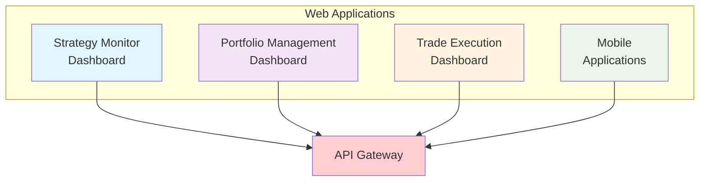
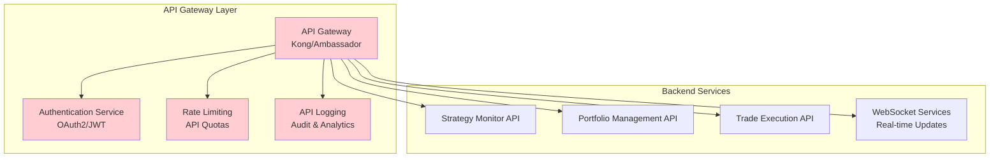
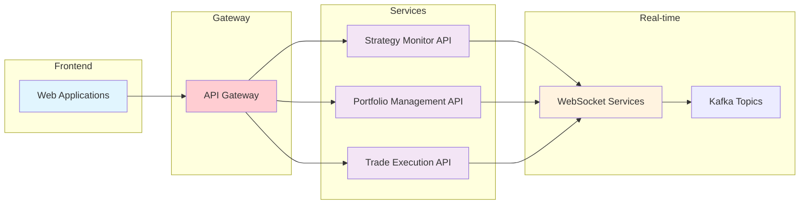

# User Interface

This directory contains the frontend components and user interfaces for the TradeStream platform. The UI provides web-based interfaces for monitoring, managing, and interacting with the trading system.

## Production System Overview

The TradeStream UI components are currently in development:

- **Status**: 🔄 **IN DEVELOPMENT** - First user-facing interface being developed
- **Technology**: HTML5, CSS3, JavaScript (ES6+), Chart.js
- **Integration**: Strategy Monitor API for real-time data
- **Vision**: Foundation for complete trading platform UI
- **Future**: Portfolio management, risk monitoring, trade execution interfaces

## Overview

The TradeStream UI components provide:

- **Strategy Monitoring**: Real-time monitoring of trading strategies
- **Performance Analytics**: Visualization of strategy performance
- **Configuration Management**: Web-based configuration interfaces
- **Alert Management**: Monitoring and alert management interfaces
- **Administrative Tools**: System administration and management tools

## Directory Structure

```
ui/
└── strategy-monitor/     # Strategy monitoring web application
    ├── index.html        # Main application entry point
    ├── README.md         # Application-specific documentation
    ├── BUILD            # Bazel build configuration
    └── assets/          # Static assets (CSS, JS, images)
```

## Components

### Strategy Monitor

The `strategy-monitor` application provides a web-based interface for monitoring trading strategies in real-time.

#### Features

- **Real-time Dashboard**: Live monitoring of strategy performance
- **Performance Charts**: Interactive charts showing strategy metrics
- **Alert Management**: View and manage trading alerts
- **Configuration Interface**: Web-based strategy configuration
- **Historical Analysis**: Historical performance analysis tools

#### Technology Stack

- **Frontend**: HTML5, CSS3, JavaScript (ES6+)
- **Charts**: Chart.js for data visualization
- **Styling**: Modern CSS with responsive design
- **Build System**: Bazel for asset compilation

#### Usage

```bash
# Build the application
bazel build //ui/strategy-monitor:all

# Serve locally for development
bazel run //ui/strategy-monitor:serve

# Deploy to production
bazel run //ui/strategy-monitor:deploy
```

#### API Integration

The strategy monitor integrates with the `strategy_monitor_api` service:

```javascript
// Example API integration
const API_BASE_URL = "http://localhost:8080/api";

async function fetchStrategies() {
  const response = await fetch(`${API_BASE_URL}/strategies`);
  const strategies = await response.json();
  return strategies;
}

async function fetchStrategyPerformance(strategyId) {
  const response = await fetch(
    `${API_BASE_URL}/strategies/${strategyId}/performance`,
  );
  const performance = await response.json();
  return performance;
}
```

## Future Platform Vision

**Current Implementation**: The strategy monitoring interface represents the first user-facing component, providing real-time visualization of strategy discovery and performance metrics.

**Future Platform Vision**: Additional UI interfaces will be developed for portfolio management, risk monitoring, and trade execution, all served through a unified API gateway for a complete trading platform experience.

### Planned Platform Architecture

#### Web Applications Layer



#### API Gateway Services



#### Service Integration Flow



## Development

### Prerequisites

- Modern web browser (Chrome, Firefox, Safari, Edge)
- Node.js (for development tools)
- Bazel build system

### Local Development

```bash
# Clone the repository
git clone https://github.com/tradestream/tradestream.git
cd tradestream

# Build UI components
bazel build //ui/...

# Serve development server
bazel run //ui/strategy-monitor:serve
```

### Building for Production

```bash
# Build optimized production assets
bazel build //ui/strategy-monitor:prod

# Create deployment package
bazel run //ui/strategy-monitor:package
```

## Architecture

### Frontend Architecture

The UI follows modern web development practices:

- **Progressive Enhancement**: Works without JavaScript, enhanced with JS
- **Responsive Design**: Mobile-first responsive design
- **Accessibility**: WCAG 2.1 AA compliance
- **Performance**: Optimized loading and rendering

### Component Structure

```
ui/strategy-monitor/
├── index.html              # Main application entry point
├── assets/
│   ├── css/               # Stylesheets
│   │   ├── main.css       # Main styles
│   │   ├── components.css # Component styles
│   │   └── responsive.css # Responsive design
│   ├── js/                # JavaScript modules
│   │   ├── app.js         # Main application logic
│   │   ├── api.js         # API integration
│   │   ├── charts.js      # Chart rendering
│   │   └── utils.js       # Utility functions
│   └── images/            # Static images and icons
└── README.md              # Component documentation
```

## Styling

### Design System

The UI uses a consistent design system:

- **Color Palette**: Professional trading interface colors
- **Typography**: Clear, readable fonts for data display
- **Spacing**: Consistent spacing and layout grid
- **Components**: Reusable UI components

### CSS Architecture

```css
/* Example component styling */
.strategy-card {
  background: var(--card-bg);
  border-radius: var(--border-radius);
  padding: var(--spacing-md);
  box-shadow: var(--shadow-sm);
}

.strategy-performance {
  display: grid;
  grid-template-columns: repeat(auto-fit, minmax(200px, 1fr));
  gap: var(--spacing-md);
}
```

## JavaScript Architecture

### Module Structure

```javascript
// app.js - Main application
import { API } from "./api.js";
import { ChartManager } from "./charts.js";
import { AlertManager } from "./alerts.js";

class StrategyMonitor {
  constructor() {
    this.api = new API();
    this.charts = new ChartManager();
    this.alerts = new AlertManager();
  }

  async initialize() {
    await this.loadStrategies();
    this.setupEventListeners();
    this.startRealTimeUpdates();
  }
}
```

### API Integration

```javascript
// api.js - API client
export class API {
  constructor(baseURL = "/api") {
    this.baseURL = baseURL;
  }

  async request(endpoint, options = {}) {
    const url = `${this.baseURL}${endpoint}`;
    const response = await fetch(url, {
      headers: {
        "Content-Type": "application/json",
        ...options.headers,
      },
      ...options,
    });

    if (!response.ok) {
      throw new Error(`API Error: ${response.status}`);
    }

    return response.json();
  }

  async getStrategies() {
    return this.request("/strategies");
  }

  async getStrategyPerformance(strategyId) {
    return this.request(`/strategies/${strategyId}/performance`);
  }
}
```

## Data Visualization

### Chart Components

The UI includes comprehensive charting capabilities:

```javascript
// charts.js - Chart management
export class ChartManager {
  constructor() {
    this.charts = new Map();
  }

  createPerformanceChart(containerId, data) {
    const ctx = document.getElementById(containerId).getContext("2d");
    const chart = new Chart(ctx, {
      type: "line",
      data: {
        labels: data.labels,
        datasets: [
          {
            label: "Performance",
            data: data.values,
            borderColor: "#4CAF50",
            backgroundColor: "rgba(76, 175, 80, 0.1)",
          },
        ],
      },
      options: {
        responsive: true,
        maintainAspectRatio: false,
      },
    });

    this.charts.set(containerId, chart);
    return chart;
  }
}
```

## Responsive Design

### Mobile-First Approach

The UI is designed with mobile-first responsive design:

```css
/* Base styles for mobile */
.strategy-grid {
  display: grid;
  grid-template-columns: 1fr;
  gap: 1rem;
}

/* Tablet styles */
@media (min-width: 768px) {
  .strategy-grid {
    grid-template-columns: repeat(2, 1fr);
  }
}

/* Desktop styles */
@media (min-width: 1024px) {
  .strategy-grid {
    grid-template-columns: repeat(3, 1fr);
  }
}
```

## Performance Optimization

### Asset Optimization

- **Minification**: CSS and JavaScript are minified for production
- **Compression**: Assets are compressed (gzip/brotli)
- **Caching**: Proper cache headers for static assets
- **Lazy Loading**: Images and non-critical resources loaded on demand

### Loading Strategy

```javascript
// Lazy load non-critical components
document.addEventListener("DOMContentLoaded", () => {
  // Load critical components immediately
  initializeCoreComponents();

  // Lazy load additional features
  if (document.querySelector(".advanced-charts")) {
    import("./advanced-charts.js").then((module) => {
      module.initializeAdvancedCharts();
    });
  }
});
```

## Testing

### Testing Strategy

The UI includes comprehensive testing:

- **Unit Tests**: Individual component testing
- **Integration Tests**: API integration testing
- **Visual Regression Tests**: UI consistency testing
- **Accessibility Tests**: WCAG compliance testing

### Test Examples

```javascript
// Example unit test
describe("StrategyMonitor", () => {
  test("should load strategies on initialization", async () => {
    const monitor = new StrategyMonitor();
    const mockApi = { getStrategies: jest.fn() };
    monitor.api = mockApi;

    await monitor.initialize();
    expect(mockApi.getStrategies).toHaveBeenCalled();
  });
});
```

## Deployment

### Production Build

```bash
# Build production assets
bazel build //ui/strategy-monitor:prod

# Create deployment package
bazel run //ui/strategy-monitor:package
```

### Docker Deployment

```dockerfile
# Example Dockerfile
FROM nginx:alpine
COPY bazel-bin/ui/strategy-monitor/index.html /usr/share/nginx/html/
COPY bazel-bin/ui/strategy-monitor/assets/ /usr/share/nginx/html/assets/
EXPOSE 80
CMD ["nginx", "-g", "daemon off;"]
```

## Monitoring

### User Analytics

The UI includes analytics for user behavior:

- **Page Views**: Track page usage patterns
- **Feature Usage**: Monitor feature adoption
- **Performance Metrics**: Track loading times and errors
- **User Feedback**: Collect user feedback and ratings

### Error Tracking

```javascript
// Error tracking integration
window.addEventListener("error", (event) => {
  console.error("Application Error:", event.error);
  // Send to error tracking service
  trackError(event.error);
});
```

## Security

### Security Measures

- **Content Security Policy**: CSP headers for XSS protection
- **HTTPS Only**: All connections use HTTPS
- **Input Validation**: Client-side input validation
- **CSRF Protection**: CSRF tokens for form submissions

### Security Headers

```html
<!-- Example security headers -->
<meta
  http-equiv="Content-Security-Policy"
  content="default-src 'self'; script-src 'self' 'unsafe-inline';"
/>
<meta http-equiv="X-Frame-Options" content="DENY" />
<meta http-equiv="X-Content-Type-Options" content="nosniff" />
```

## Contributing

When contributing to UI components:

1. **Follow Design System**: Use established design patterns
2. **Test Responsively**: Test on multiple screen sizes
3. **Accessibility**: Ensure WCAG compliance
4. **Performance**: Optimize for fast loading
5. **Documentation**: Update documentation for changes

## License

This project is part of the TradeStream platform. See the root LICENSE file for details.
